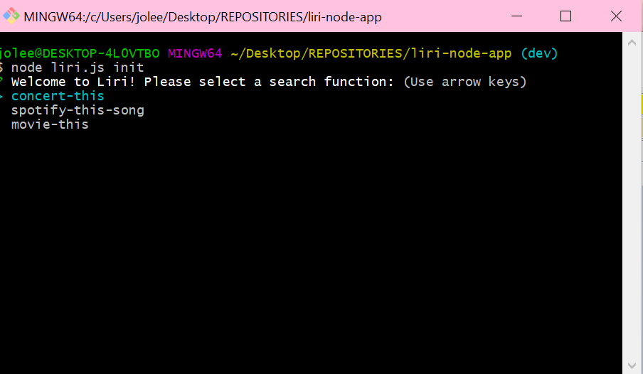
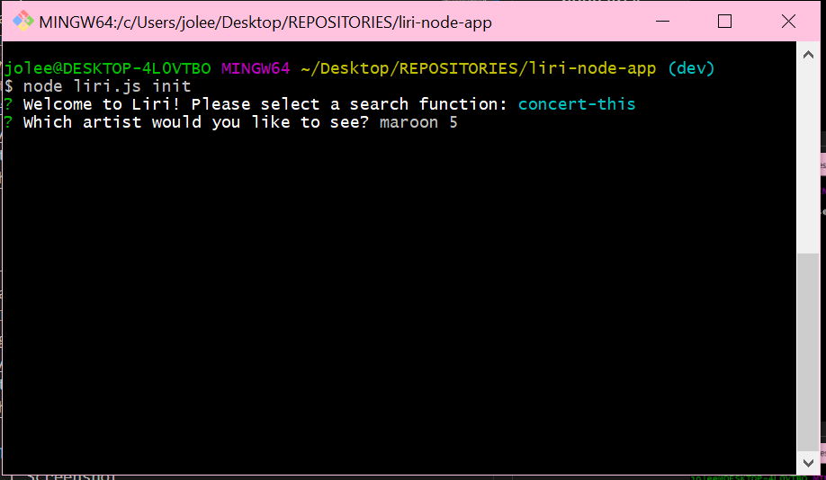
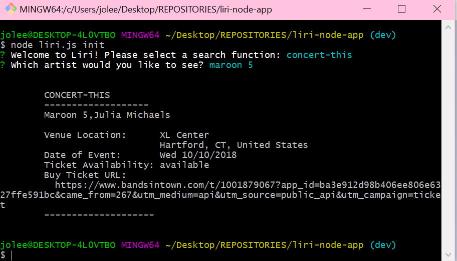
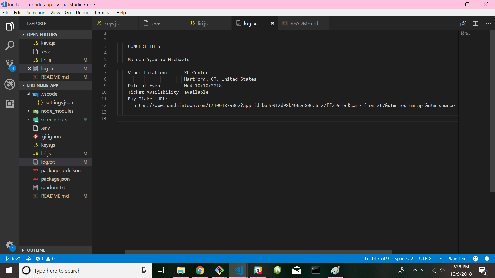
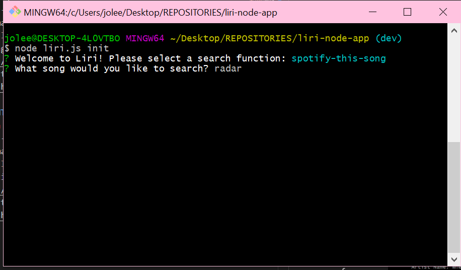
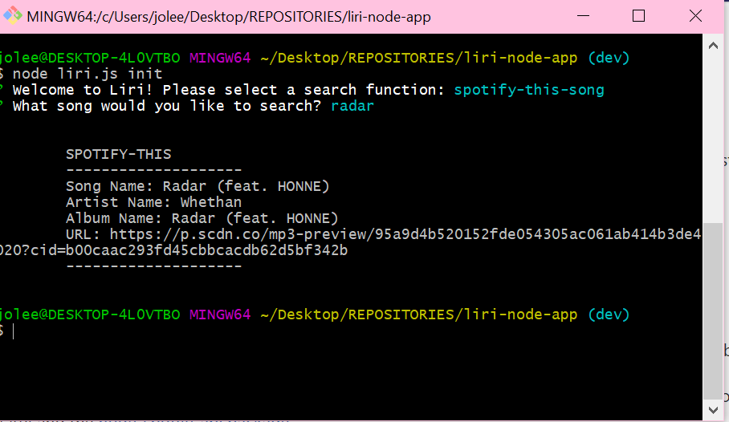
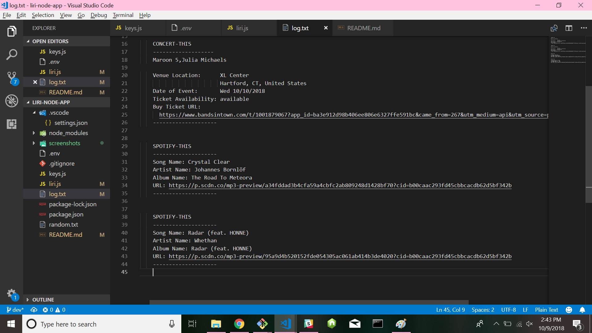
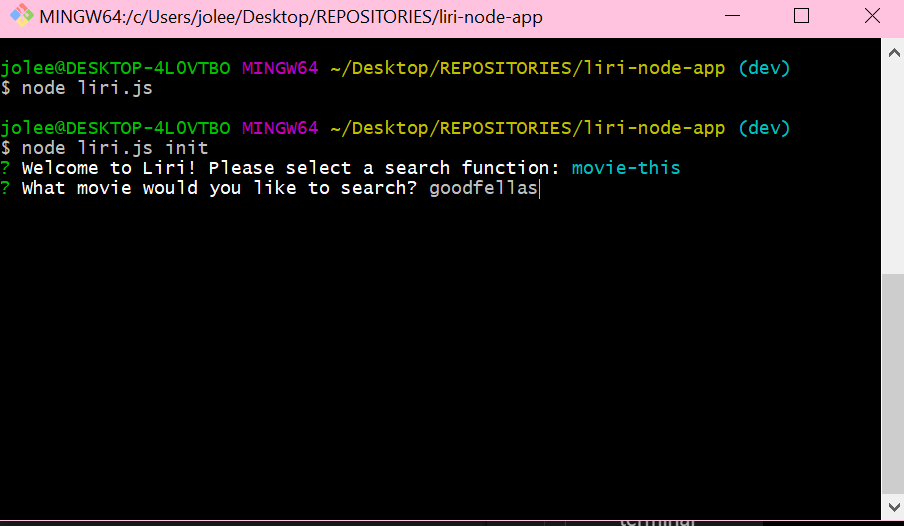
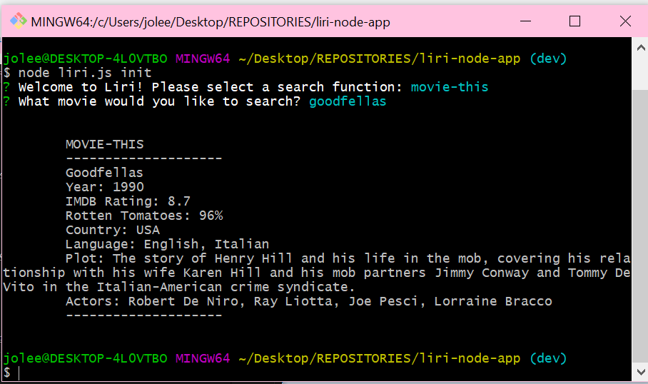
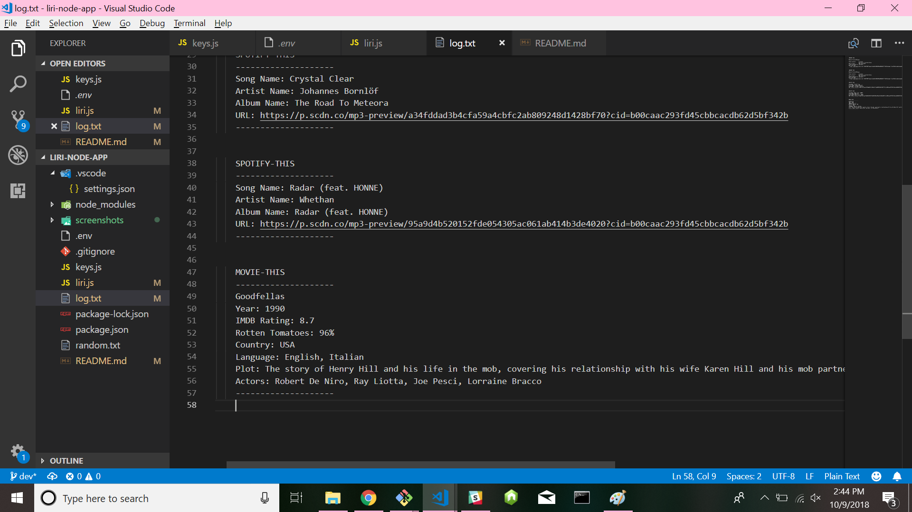

# liri-node-app
 LIRI is a Language Interpretation and Recognition Interface. LIRI is a command line node app that takes in parameters and gives the user back data.

 ## BANDSINTOWN
Description | Screenshot
 ----------- | ----------
 Enter command *node liri.js init* into terminal | 
 Select *concert-this* and choose artist | 
 Result returned in terminal | 
 Check Log.txt to ensure result is logged | 

 ## SPOTIFY
Description | Screenshot
 ----------- | ----------
 Enter command *node liri.js init* into terminal | 
 Select *spotify-this-song* and choose artist | 
 Result returned in terminal | 
 Check Log.txt to ensure result is logged | 

 ## BANDSINTOWN
Description | Screenshot
 ----------- | ----------
 Enter command *node liri.js init* into terminal | 
 Select *movie-this* and choose artist | 
 Result returned in terminal | 
 Check Log.txt to ensure result is logged | 
